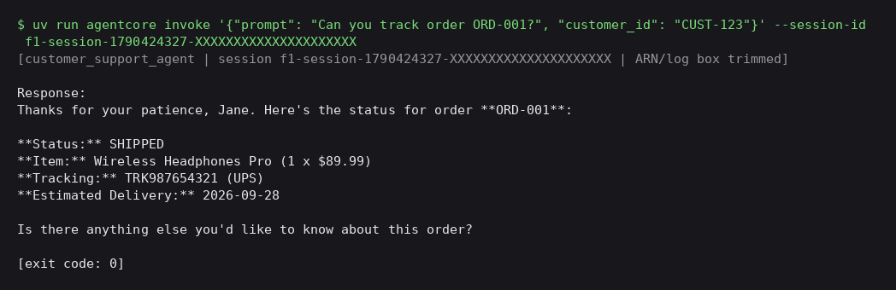
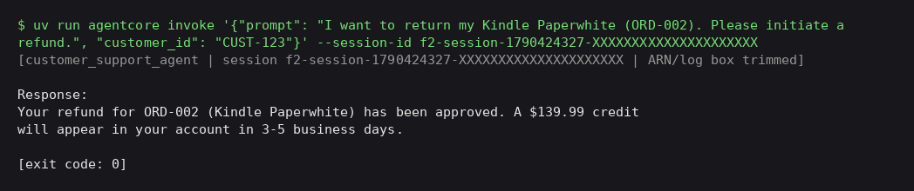
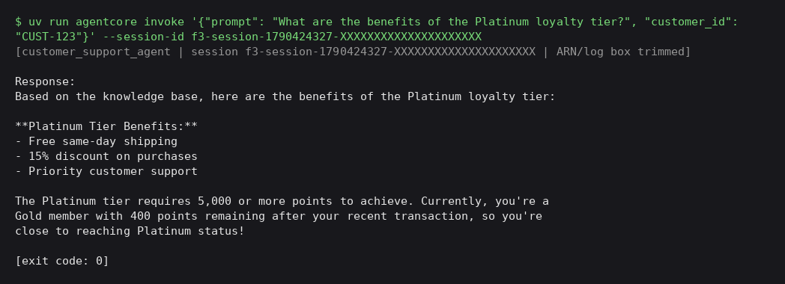
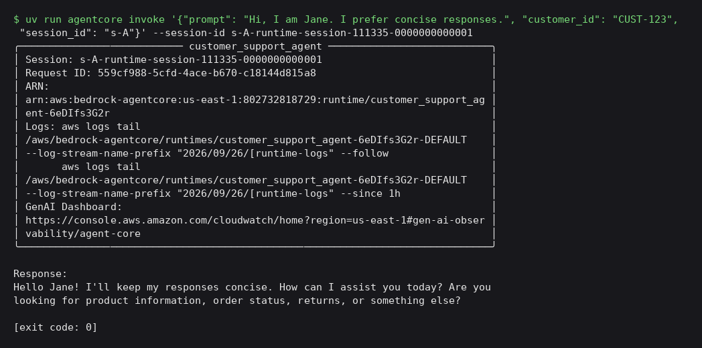
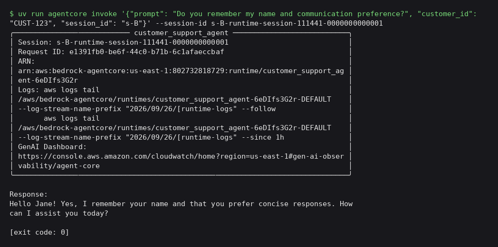
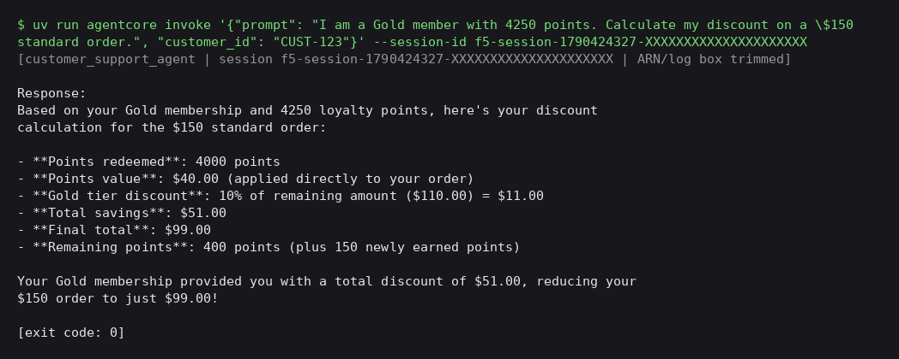
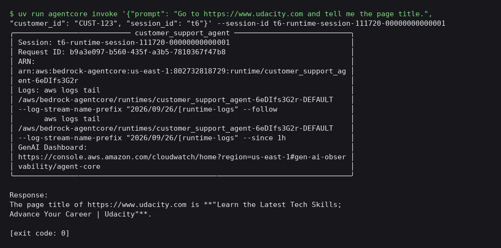

# AI Customer Support Agent with Amazon Bedrock AgentCore and Strands

This is a customer support agent for a made-up Amazon-style store. I built it with **Amazon Bedrock AgentCore** (Runtime, Gateway, Memory, Code Interpreter, Browser), the **Strands Agents SDK** and **Amazon Nova 2 Lite**. It answers product and policy questions from a Bedrock Knowledge Base, looks up orders and handles refunds through Lambda tools behind an MCP Gateway, remembers customers between sessions, works out loyalty discounts in a sandboxed Code Interpreter, and reads live web pages with a managed browser.

Built for Udacity's **"AI Support Agent"** project in the course *Building Agents with Amazon Bedrock AgentCore and Strands SDK*.

## Project Overview

```
                        agentcore invoke '{"prompt", "customer_id", "session_id"}'
                                              │
                                              ▼
┌───────────────────────── AgentCore Runtime: customer_support_agent (us-east-1) ────────────────────────┐
│  main.py → @app.entrypoint invoke()                                                                    │
│                                                                                                        │
│   Strands Agent (Nova 2 Lite, global.amazon.nova-2-lite-v1:0)                                          │
│     ├── MemoryHook ──────────────► AgentCore Memory (customer_facts + customer_preferences, per actor) │
│     ├── search_knowledge_base ───► Bedrock Knowledge Base (product_catalog.txt in S3)                  │
│     ├── calculate_loyalty_discount ► AgentCore Code Interpreter (fallback: tier discount only)         │
│     ├── AgentCoreBrowser.browser ─► AgentCore Browser (live web pages)                                 │
│     └── MCPClient ───────────────► AgentCore Gateway (/mcp, NONE authorizer)                           │
│                                        ├── order_tracker target → API Gateway REST → order-tracker λ   │
│                                        └── refund_processor target → refund-processor λ (lambda_schema)│
└────────────────────────────────────────────────────────────────────────────────────────────────────────┘
```

**Request flow:** for each call, `invoke()` reads `prompt`, `customer_id` (used as the memory actor ID) and `session_id`. It creates a `MemoryHook` and an `AgentCoreBrowser`, opens an MCP session to the Gateway, loads the Gateway tools, and runs a Strands `Agent` with every tool and hook attached.
- **Before the model runs:** `MemoryHook.retrieve_customer_context` searches each memory namespace (`namespaceTemplates[0]`, or the legacy `namespaces[0]`) for the customer and adds the matches to the user message as a `Customer Context:` block.
- **After the model responds:** `MemoryHook.save_support_interaction` saves the (user, assistant) turn with `create_event`, so AgentCore Memory can pull facts and preferences out of it.

## Quick Start

```bash
cd starter
uv sync --python 3.13

# Configure and deploy (Python Starter Toolkit CLI)
uv run agentcore configure --entrypoint main.py --name customer_support_agent \
  --deployment-type direct_code_deploy --runtime PYTHON_3_13 --disable-memory
uv run agentcore deploy

# Let the runtime role use the KB, Memory and Browser
uv run setup_permissions.py            # add --dry-run to preview the policy

# Talk to the deployed agent
uv run agentcore invoke '{"prompt": "Can you track order ORD-001?", "customer_id": "CUST-123", "session_id": "t1"}'
```

> Before deploying, set `GATEWAY_URL`, `KB_ID`, `REGION` and `MEMORY_ID` in `starter/main.py` to your own resources. They must be literal strings because `setup_permissions.py` parses them from the file.

## Architecture

### Cloud Infrastructure (Region: us-east-1)

| Component | Name | Purpose |
|-----------|------|---------|
| **AgentCore Runtime** | `customer_support_agent` | Hosts `main.py` (direct code deploy, Python 3.13) |
| **Foundation model** | Amazon Nova 2 Lite (`global.amazon.nova-2-lite-v1:0`) | Reasoning and tool selection |
| **AgentCore Gateway** | `CustomerSupportGateway` (NONE authorizer) | Exposes the Lambda tools over MCP |
| **Gateway target** | `order_tracker` (API Gateway target) | `get_order`, `get_customer_orders`, `get_customer` |
| **Gateway target** | `refund_processor` (Lambda target) | `initiate_refund`, `check_refund_status`, `get_return_label` |
| **API Gateway** | REST API, Lambda proxy integration | `GET /orders/{order_id}`, `GET /customers/{customer_id}/orders`, `GET /customers/{customer_id}` |
| **Lambda** | `order-tracker` | Mock order and customer lookup (`lambda/order_tracker.py`) |
| **Lambda** | `refund-processor` | Mock refunds and return labels (`lambda/refund_processor.py`) |
| **Knowledge Base** | `CustomerSupportKB` (managed, S3 data source) | RAG over `product_catalog.txt` |
| **AgentCore Memory** | `CustomerSupportMemory` | Long-term memory per customer |
| **Code Interpreter** | AgentCore built-in | Exact loyalty discount calculations |
| **Browser** | AgentCore built-in (`aws.browser.v1`) | Live web lookups |

### Agent Tools

**`search_knowledge_base(query)`** (local tool)
- Calls `bedrock-agent-runtime.retrieve` on the Knowledge Base and joins the result chunks with `\n---\n`
- Covers product specs, return windows, the loyalty program and order status definitions

**`calculate_loyalty_discount(loyalty_points, tier, order_total, product_category)`** (local tool)
- Builds a Python snippet and runs it in the AgentCore Code Interpreter (`code_session`, `executeCode`, `clearContext=True`)
- Rules, from the catalog: 100 points = $1, redeemed in 500-point blocks and capped at 50% of the order; tier discount (Silver 0%, Gold 10%, Platinum 15%) applies to the total *after* points; points earned are 1, 2 or 5 per $ for standard, device or fresh items
- Returns JSON: `points_redeemed`, `points_value`, `tier_discount`, `final_total`, `total_savings`, `points_earned`, `remaining_points`
- **Fallback:** if the Code Interpreter isn't available, it applies only the tier discount (no points) and adds a `note` field saying so

**AgentCore Browser** (`strands_tools.browser.AgentCoreBrowser`)
- Opens a managed browser session to read live pages such as the Udacity homepage title

**Gateway tools** (MCP via `MCPClient` + `streamable_http_client`)
- Listed at runtime with `list_tools_sync()`. Tool names may have a target prefix (`target___tool`)

### Memory Strategies

| Strategy | Name | Namespace |
|---|---|---|
| Semantic extraction | `customer_facts` | `cs_agent/{actorId}/facts` |
| User preference | `customer_preferences` | `cs_agent/{actorId}/preferences` |

`{actorId}` is filled in with the request's `customer_id`, so each customer's memories are kept separate.

## Testing & Results

All six scenarios from `starter/SUBMISSION_CHECKLIST.md` were run against the deployed runtime. The full terminal output is in [`starter/test_outputs/`](starter/test_outputs/) and screenshots are in [`starter/screenshots/`](starter/screenshots/).

| # | Scenario | Capability | Result |
|---|----------|------------|--------|
| 1 | Track order ORD-001 | Gateway → API Gateway → `order-tracker` | ✅ Pass |
| 2 | Refund Kindle Paperwhite (ORD-002) | Gateway → `refund-processor` | ✅ Pass (amount shows `$0`, see below) |
| 3 | Platinum tier benefits | Knowledge Base (RAG) | ✅ Pass |
| 4 | Remember name and preference across sessions | AgentCore Memory | ✅ Pass |
| 5 | Gold, 4,250 points, $150 standard order | Code Interpreter | ⚠️ Known issue: answered **$95**, correct answer is **$99** |
| 6 | Udacity.com page title | AgentCore Browser | ✅ Pass |

**Score: 5 of 6 pass. Test 5 is a known issue (see [Known Issues](#known-issues)).**

### Test 1 — Order Tracking

Returned status **SHIPPED**, tracking number **TRK987654321**, carrier **UPS**, the item and total ($89.99), and an estimated delivery date.



### Test 2 — Refund Processing

Called `initiate_refund` and returned a refund ID (`REF-…`), status **APPROVED**, and "Credit appears in 3-5 business days." The response shows **Refund Amount: $0** (see [Known Issues](#known-issues)).



### Test 3 — Knowledge Base (RAG)

Returned the Platinum benefits from the catalog: **free same-day shipping, 15% discount, priority customer support**, plus the 5,000-point threshold.



### Test 4 — Long-Term Memory

Session `s-A`: "Hi, I am Jane. I prefer concise responses." Then, after waiting for extraction, a **new** session `s-B`: "Do you remember my name and communication preference?" The agent remembered both **Jane** and **concise responses**.




### Test 5 — Loyalty Discount (Code Interpreter)

The agent redeemed 4,000 points ($40), but it took the 10% Gold discount on the original $150 ($15) instead of on the $110 left after points, and answered **$95.00**. The correct answer is **$99.00**. The tool returns that for this input, and a fresh customer gets $99.



### Test 6 — Browser

Returned the live page title: **"Learn the Latest Tech Skills; Advance Your Career | Udacity"**.



### How to Re-run the Tests

```bash
cd starter
uv run agentcore invoke '{"prompt": "Can you track order ORD-001?", "customer_id": "CUST-123", "session_id": "t1"}'
uv run agentcore invoke '{"prompt": "I want to return my Kindle Paperwhite (ORD-002). Please initiate a refund.", "customer_id": "CUST-123", "session_id": "t2"}'
uv run agentcore invoke '{"prompt": "What are the benefits of the Platinum loyalty tier?", "customer_id": "CUST-123", "session_id": "t3"}'
uv run agentcore invoke '{"prompt": "Hi, I am Jane. I prefer concise responses.", "customer_id": "CUST-123", "session_id": "s-A"}'
# wait at least 30 seconds for memory extraction
uv run agentcore invoke '{"prompt": "Do you remember my name and communication preference?", "customer_id": "CUST-123", "session_id": "s-B"}'
uv run agentcore invoke '{"prompt": "I am a Gold member with 4250 points. Calculate my discount on a $150 standard order.", "customer_id": "CUST-123", "session_id": "t5"}'
uv run agentcore invoke '{"prompt": "Go to https://www.udacity.com and tell me the page title.", "customer_id": "CUST-123", "session_id": "t6"}'
```

## Known Issues

### Test 5: the agent trusted an old remembered total over the tool

**Expected result** (`calculate_loyalty_discount`): 4,000 points → $40 off → $110 subtotal → 10% Gold discount ($11) → **$99.00** final, $51 saved, 400 points remaining.

**What happened:** `CUST-123` had already been used in earlier runs. Its long-term memory held an **older, wrong discount total**, and `MemoryHook` added that to the prompt as `Customer Context`. The agent went with the remembered number instead of the tool's result and answered $95. A customer with no memory history gets the correct $99.

**Possible fixes:**
- **Tell the agent to prefer fresh tool results over remembered numbers.** Add a line to the system prompt saying prices, totals and discounts must come from the current tool call, and memory is only for preferences and background.
- **Don't save calculated totals to memory.** Filter numeric or transactional results out of `save_support_interaction`, or keep memory strategies to facts and preferences, so stale figures never come back.
- For a clean re-test, use a new `customer_id` or delete the old memory records for `CUST-123`.

### Test 2: refund amount shows `$0`

In `lambda_schema`, `initiate_refund` requires only `order_id` and `reason`. `amount` is optional, and `refund_processor.py` defaults it to `0`. The agent didn't pass an amount, so the mock Lambda echoed `$0`. The refund flow still works (refund ID, APPROVED, 3–5 day message). A fix would be to have the agent look up the order total (`get_order`) and pass it, or make `amount` required in the schema.

## Security Note

> ⚠️ **Sandbox only.** The AgentCore Gateway uses the **NONE** authorizer because the starter's MCP connection is unsigned. Anyone who has the Gateway URL can call its tools. That's acceptable only for this sandbox project with mock data. Don't use this setup in production, don't send real or sensitive data through it, and delete the Gateway when you're done. In production, use an inbound authorizer (for example Cognito / OAuth JWT or IAM) and sign the MCP requests.

`setup_permissions.py` adds a single least-privilege inline policy (`CustomerSupportIntegrations`) to the runtime execution role: `bedrock:Retrieve` on the one Knowledge Base, `GetMemory` / `RetrieveMemoryRecords` / `CreateEvent` on the one Memory resource, and the browser-session actions on `aws.browser.v1`.

## Cleanup / Teardown

To stop paying for these resources, delete them once the project is graded. **The OpenSearch Serverless collection behind the Knowledge Base bills by the hour even when idle.**

1. **AgentCore Runtime:** from `starter/`, run `uv run agentcore destroy`. This removes the runtime, its endpoint and the toolkit-created resources.
2. **AgentCore Gateway:** delete `CustomerSupportGateway` and its `order_tracker` / `refund_processor` targets (Bedrock → AgentCore → Gateways).
3. **AgentCore Memory:** delete `CustomerSupportMemory` (Bedrock → AgentCore → Memory).
4. **Knowledge Base:** delete `CustomerSupportKB` and its data source.
5. **OpenSearch Serverless collection:** delete the vector collection created for the KB, if it wasn't removed with the KB (OpenSearch Service → Serverless → Collections), plus its leftover security and data-access policies.
6. **S3:** empty and delete the bucket holding `product_catalog.txt`.
7. **API Gateway:** delete the REST API that fronts `order-tracker`.
8. **Lambda:** delete `order-tracker` and `refund-processor`, and their CloudWatch log groups if you like.
9. **IAM:** delete any roles created for the Lambdas, KB and runtime that `agentcore destroy` didn't remove.

## Files Reference

| File | Description |
|------|-------------|
| `starter/main.py` | Agent: config, model, `MemoryHook`, KB tool, Code Interpreter discount tool, browser, Gateway MCP client, `@app.entrypoint` |
| `starter/setup_permissions.py` | Adds the KB / Memory / Browser inline policy to the runtime role (`--dry-run` supported) |
| `starter/lambda/order_tracker.py` | Order and customer lookup Lambda (API Gateway proxy events, mock data) |
| `starter/lambda/refund_processor.py` | Refund Lambda (Gateway Lambda target; tool name read from client context) |
| `starter/lambda/lambda_schema` | MCP tool schema for `initiate_refund`, `check_refund_status`, `get_return_label` |
| `starter/product_catalog.txt` | Products, return/refund policy and loyalty program (Knowledge Base source) |
| `starter/pyproject.toml` | Python 3.13 dependencies (`strands-agents`, `bedrock-agentcore`, starter toolkit, Playwright, …) |
| `starter/SUBMISSION_CHECKLIST.md` | The six test commands and submission checklist |
| `starter/test_outputs/*.txt` | Full terminal output for each test run |
| `starter/screenshots/*.png` | Screenshots of each test run |

## Reflection

See [REFLECTION.md](REFLECTION.md).

## License

Built for the Udacity course *Building Agents with Amazon Bedrock AgentCore and Strands SDK*. The starter code is © Udacity, Inc.; see [`LICENSE.txt`](LICENSE.txt).
